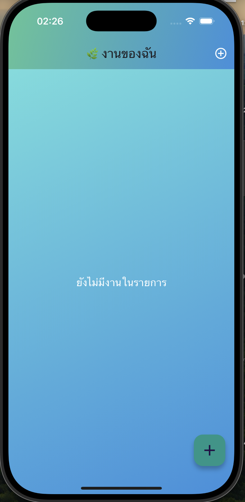
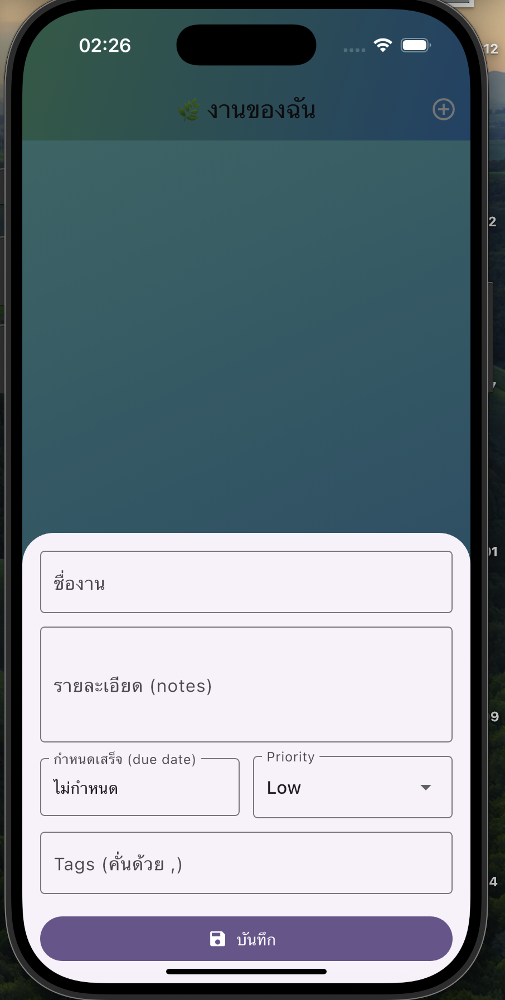

# To-Do (Provider + SQLite) — Enhanced

<p align="center">
  
  
</p>

Features beyond the base example:
-  CRUD พร้อม Provider + SQLite (ออฟไลน์)
-  ค้นหาตามชื่อเรื่องหรือแท็ก
-  แท็ก (คั่นด้วยจุลภาค)
-  วันครบกำหนดพร้อมไฮไลต์วันที่เลยกำหนด
-  ลำดับความสำคัญ (ต่ำ, กลาง, สูง)
-  สถิติ (ทั้งหมด / กำลังดำเนินการ / เสร็จสิ้น)
-  ยกเลิกเมื่อลบ (SnackBar)
-  เลือกหลายรายการ + ลบจำนวนมาก
-  เรียงลำดับตาม กำหนด / ลำดับความสำคัญ / สร้าง
-  UI ที่สวยงามด้วย Material 3 และธีมสีม่วง/ขาว

## Quick start
```bash
flutter pub get
flutter run
```

## Structure
```
lib/
  main.dart
  models/
    todo.dart
  providers/
    todo_provider.dart
  services/
    todo_db.dart
  screens/
    home_screen.dart
    task_form.dart
```

---

This app is built from the base sample that uses Provider + SQLite and adds UI/UX and data model improvements for AS-08.
# todo_provider_sqlite
